# Lab 01: Manage Microsoft Entra ID Identities

[⬅ Back to AZ-104 series overview](../README.md)

## 📋 Overview

This folder documents my hands-on lab work for **AZ-104 (Microsoft Azure Administrator)** — Lab 01: *Manage Microsoft Entra ID Identities*. The goal of this lab was to provision and manage identities for a fictional pre-production lab environment, including:

- Creating and configuring a standard user account
- Inviting an external (guest) user
- Creating a Security group with assigned membership
- Adding owners and members to the group

## 🎯 Lab Scenario

> An organization is building a new lab environment for pre-production testing. Engineers need to authenticate via Microsoft Entra ID, so users and groups must be provisioned, with group membership designed to be managed efficiently.

## 🛠️ Tools Used

- Microsoft Azure Portal
- Microsoft Entra ID (formerly Azure Active Directory)
- Region: East US

---

## 🧭 Step-by-Step Walkthrough

### Task 1: Create and Configure User Accounts

#### Step 1 — Sign in to the Azure Portal
Signed in at `portal.azure.com` and dismissed the welcome splash screen.

📸 **Screenshot:** `01-portal-signin.png` — capture the Azure portal home page right after signing in.

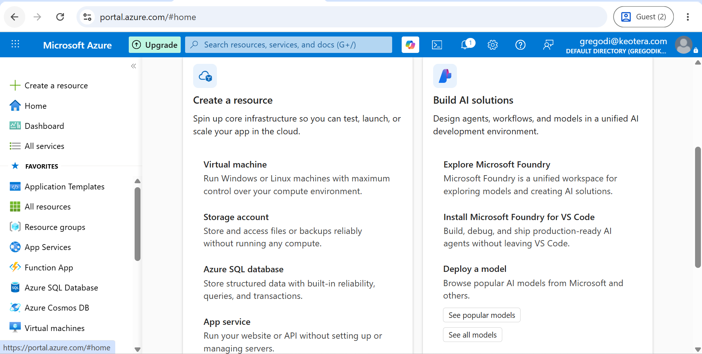

#### Step 2 — Open Microsoft Entra ID
Navigated to the Microsoft Entra ID service from the search bar.

📸 **Screenshot:** `02-entra-overview.png` — capture the Microsoft Entra ID Overview blade.

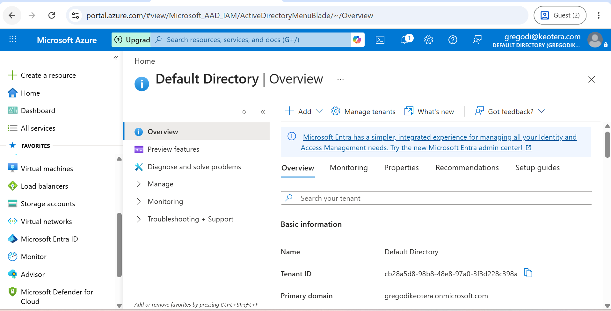

#### Step 3 — Create a new user (`az104-user1`)
Created a new internal user with the following properties:

| Field | Value |
|---|---|
| User principal name | az104-user1 |
| Display name | az104-user1 |
| Job title | IT Lab Administrator |
| Department | IT |
| Usage location | United States |

📸 **Screenshot:** `03-create-user.png` — capture the "Create new user" form filled in with the details above (before clicking Create).

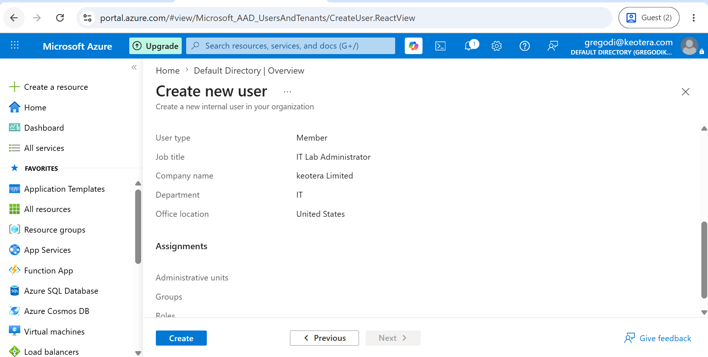

📸 **Screenshot:** `04-user-created.png` — capture the Users list after refreshing, showing `az104-user1` now exists.

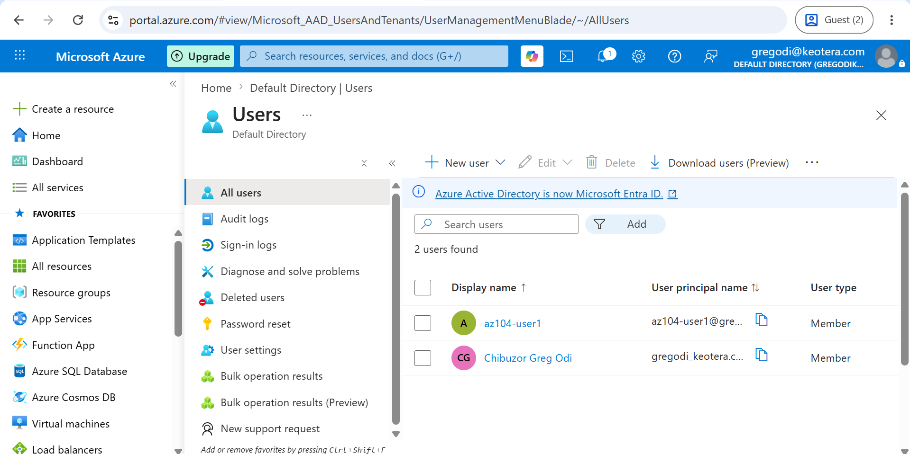

#### Step 4 — Invite an external (guest) user
Sent an invite to an external email address with a custom welcome message.

📸 **Screenshot:** `05-invite-guest.png` — capture the "Invite an external user" form filled in.

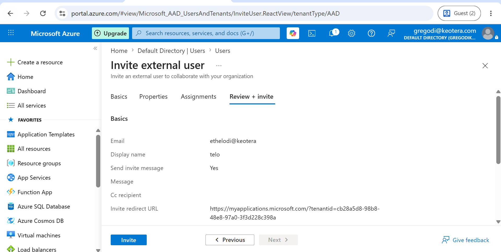

📸 **Screenshot:** `06-guest-confirmed.png` — capture the Users list showing the guest account after refreshing.

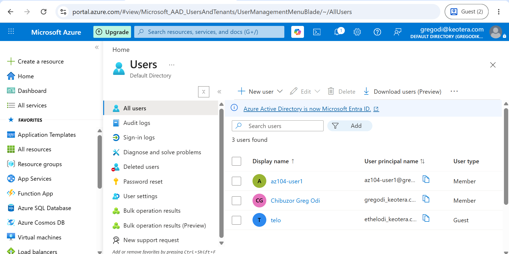

---

### Task 2: Create Groups and Add Members

#### Step 1 — Navigate to Groups
Opened the **Groups** blade under Microsoft Entra ID.

📸 **Screenshot:** `07-groups-blade.png` — capture the Groups blade (likely empty or showing default groups).

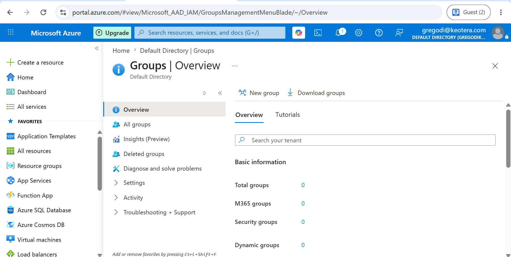

#### Step 2 — Create a new Security group
Created a group named **IT Lab Administrators** with **Assigned** membership type.

| Field | Value |
|---|---|
| Group type | Security |
| Group name | IT Lab Administrators |
| Membership type | Assigned |

📸 **Screenshot:** `08-create-group.png` — capture the "New group" form filled in with the details above (before clicking Create).

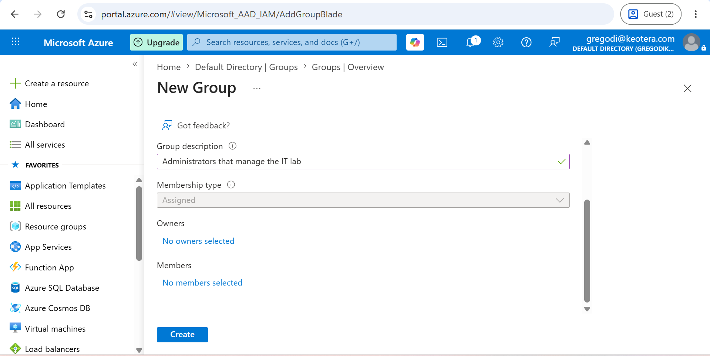

#### Step 3 — Add owner and members
Added myself as the group owner and added `az104-user1` plus the guest user as members.

📸 **Screenshot:** `09-add-owner.png` — capture the Add owners screen with yourself selected.

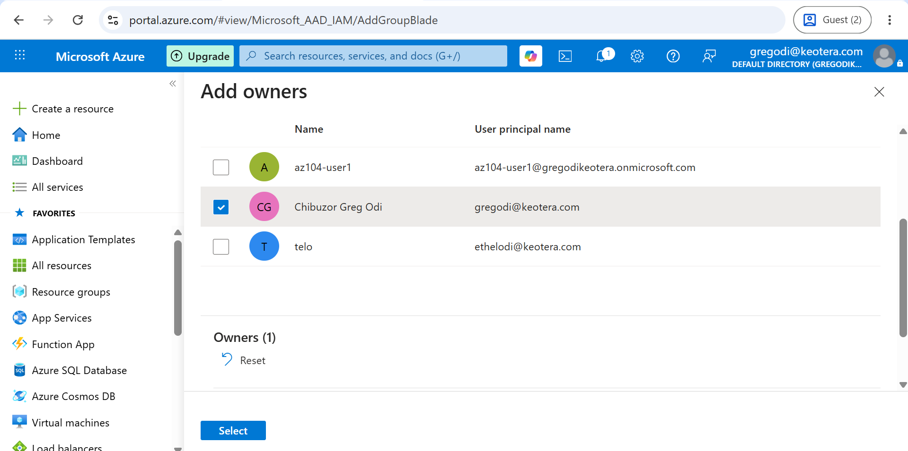

📸 **Screenshot:** `10-add-members.png` — capture the Add members screen with both users selected.

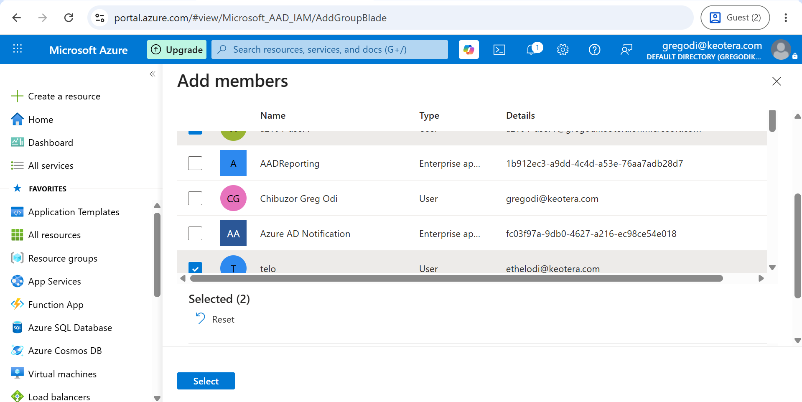

#### Step 4 — Verify the group
Confirmed the group, its members, and its owner were all created correctly.

📸 **Screenshot:** `11a-group-verified-overview.png` — capture the group Overview page showing Owners and Total members counts.

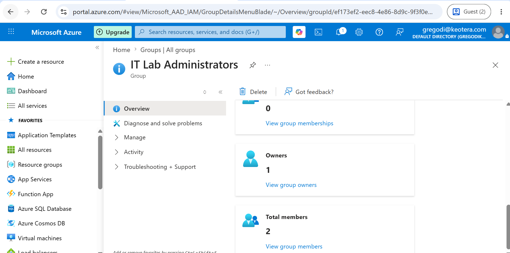

📸 **Screenshot:** `11b-group-verified-owners.png` — capture the Owners tab showing yourself listed as owner.

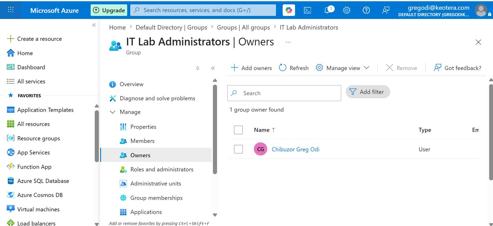

📸 **Screenshot:** `11c-group-verified-members.png` — capture the Members tab showing both az104-user1 and the guest user listed.

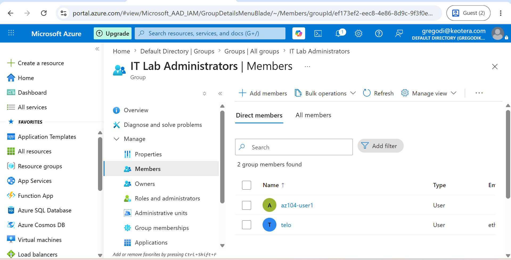

---

## ⚠️ Challenges Encountered

- **Wrong remote URL during push:** Initially set up the GitHub remote with a placeholder (`YOUR-USERNAME`) instead of the actual repo URL, which caused `git push` to fail with "repository not found." Resolved using `git remote set-url origin <correct-url>` and confirming with `git remote -v` before retrying the push.

## 💡 Key Takeaways

- A **tenant** represents an organization's dedicated instance of Microsoft Entra ID.
- Entra ID supports both **internal users** and **external guest users**, each with appropriate access scopes.
- Groups can be **Security** or **Microsoft 365** type, and membership can be **Assigned** (manual) or **Dynamic** (automatic, requires P1/P2 license).
- Proper identity governance (clear job titles, departments, group ownership) reduces administrative overhead at scale.

## 🔗 Related Resources

- [Microsoft Entra ID documentation](https://learn.microsoft.com/entra/identity/)
- [AZ-104 Certification path](https://learn.microsoft.com/credentials/certifications/azure-administrator/)

---

[⬅ Back to AZ-104 series overview](../README.md)
