# Lab 02a: Manage Subscriptions and RBAC

[⬅ Back to AZ-104 series overview](../README.md)

## 📋 Overview

This folder documents my hands-on lab work for **AZ-104 (Microsoft Azure Administrator)** — Lab 02a: *Manage Subscriptions and RBAC*. The goal of this lab was to implement role-based access control (RBAC) and management groups, including:

- Creating a management group to organize subscriptions
- Reviewing and assigning a built-in Azure role
- Creating a custom RBAC role
- Monitoring role assignments via the Activity Log

## 🎯 Lab Scenario

> To simplify management of Azure resources in the organization, I implemented a management group spanning all subscriptions and granted scoped permissions (VM management + support request creation only) to the Help Desk team.

## 🛠️ Tools Used

- Microsoft Azure Portal
- Microsoft Entra ID
- Azure RBAC / Access Control (IAM)
- Region: East US

---

## 🧭 Step-by-Step Walkthrough

### Task 1: Implement Management Groups

#### Step 1 — Sign in and review tenant-level access settings
Signed in to the Azure Portal, opened Microsoft Entra ID → Properties, and reviewed the "Access management for Azure resources" setting.

📸 **Screenshot:** `01-entra-properties.png` — capture the Microsoft Entra ID Properties blade showing the Access management toggle.

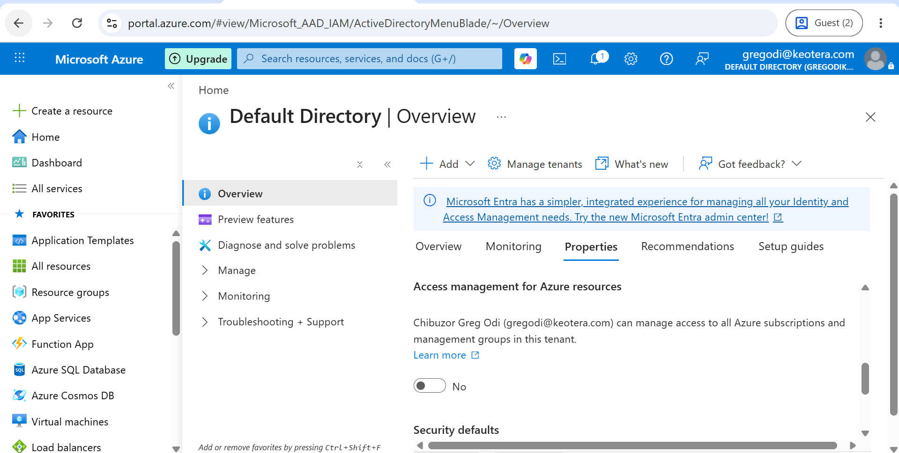

#### Step 2 — Create a management group
Navigated to Management groups → + Create, and created a group with:

| Field | Value |
|---|---|
| Management group ID | az104-mg1 |
| Management group display name | az104-mg1 |

📸 **Screenshot:** `02-create-mgmt-group.png` — capture the "Create management group" form filled in (before clicking Submit).

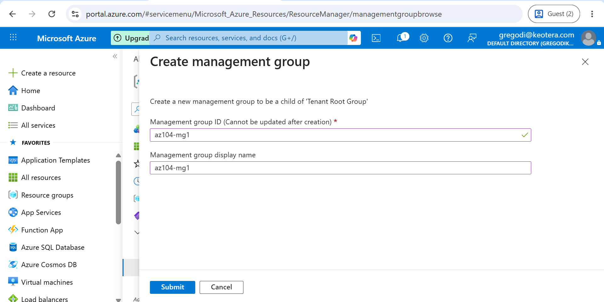

📸 **Screenshot:** `03-mgmt-group-created.png` — capture the Management groups list after refreshing, showing `az104-mg1` exists, including the root management group in the hierarchy.

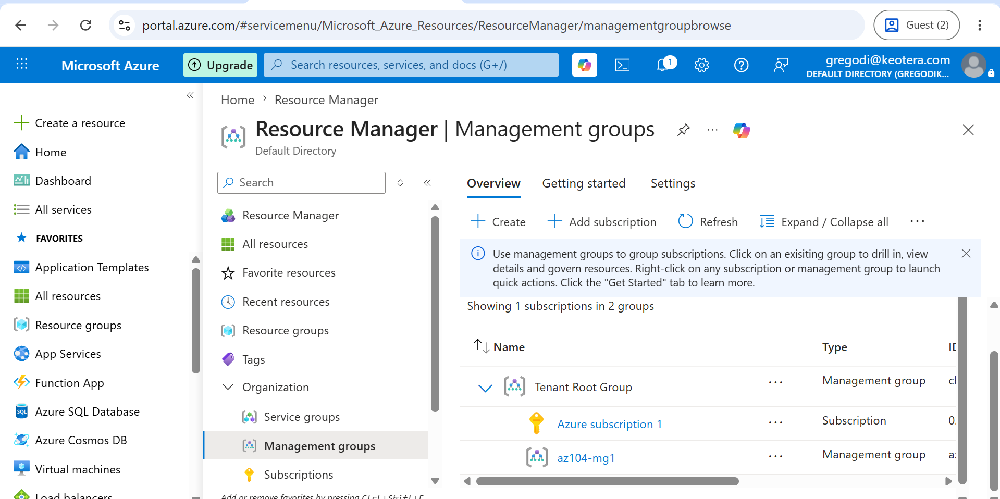

---

### Task 2: Review and Assign a Built-in Azure Role

#### Step 1 — Create the Help Desk group (if it doesn't already exist)
Created a security group named `helpdesk` (reusing the same approach as Lab 01).

📸 **Screenshot:** `04-helpdesk-group.png` — capture the helpdesk group existing in Entra ID Groups list.

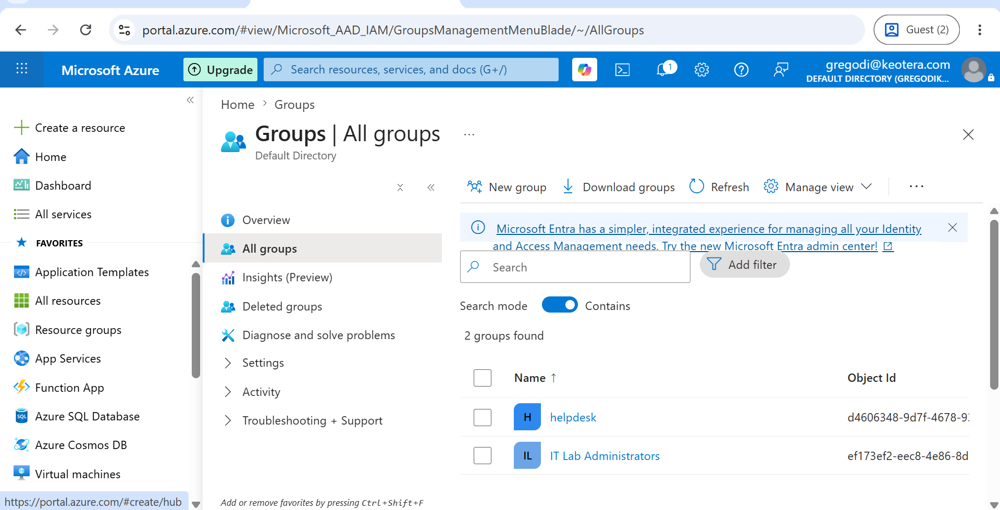

#### Step 2 — Explore built-in roles
Opened the `az104-mg1` management group → Access control (IAM) → Roles tab, and reviewed several built-in role definitions (Owner, Contributor, Reader).

📸 **Screenshot:** `05-roles-tab.png` — capture the Roles tab showing the list of built-in role definitions.

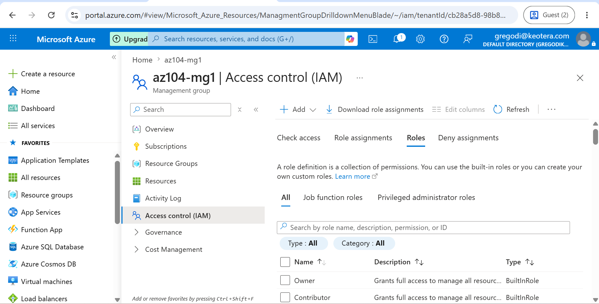

#### Step 3 — Assign the Virtual Machine Contributor role
Added a role assignment: **Virtual Machine Contributor** → Members: `helpdesk` group → Conditions: default → Assignment type: Eligible (default).

📸 **Screenshot:** `06-add-role-assignment.png` — capture the "Add role assignment" panel with Virtual Machine Contributor selected and the helpdesk group added as a member, before clicking Review + assign.

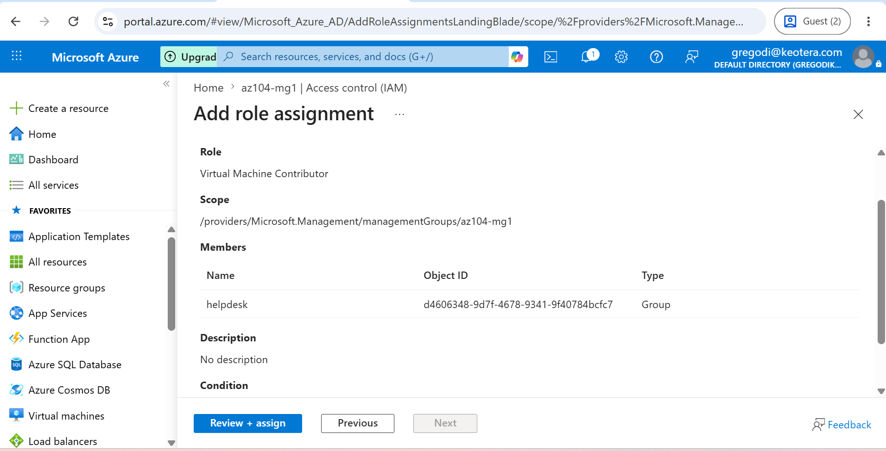

#### Step 4 — Verify the role assignment
Confirmed on the Role assignments tab that the `helpdesk` group now has the Virtual Machine Contributor role.

📸 **Screenshot:** `07-role-assignment-verified.png` — capture the Role assignments tab showing helpdesk + Virtual Machine Contributor listed.

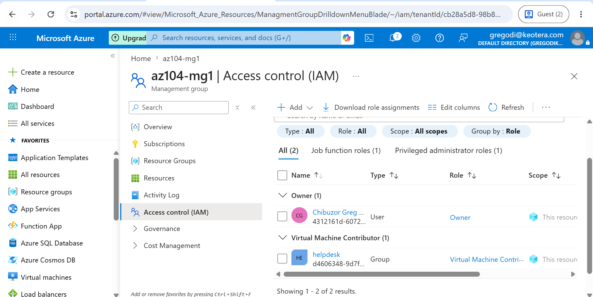

---

### Task 3: Create a Custom RBAC Role

#### Step 1 — Start a custom role from a clone
On the `az104-mg1` management group → Access control (IAM) → + Add → Add custom role. Filled in:

| Field | Value |
|---|---|
| Custom role name | Custom Support Request |
| Description | A custom contributor role for support requests. |
| Baseline permissions | Clone a role → Support Request Contributor |

📸 **Screenshot:** `08-custom-role-basics.png` — capture the Basics tab filled in with the settings above.

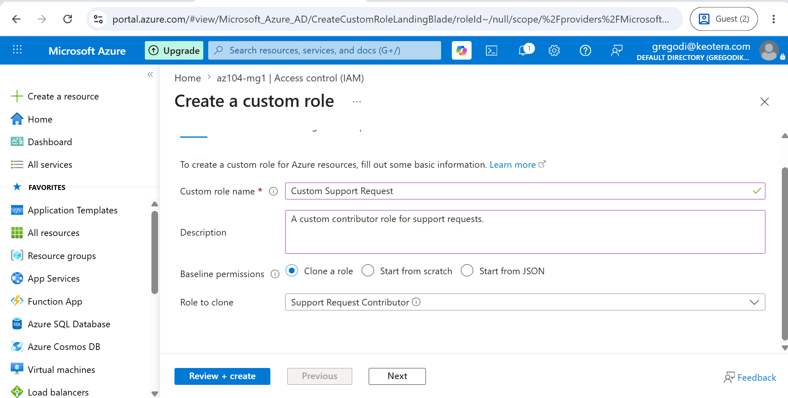

#### Step 2 — Exclude the Support Resource Provider registration permission
On the Permissions tab → + Exclude permissions → searched `.Support` → selected Microsoft.Support → checked "Other: Registers Support Resource Provider" → Add.

📸 **Screenshot:** `09-exclude-permission.png` — capture the Exclude permissions panel with the Support Resource Provider permission checked.

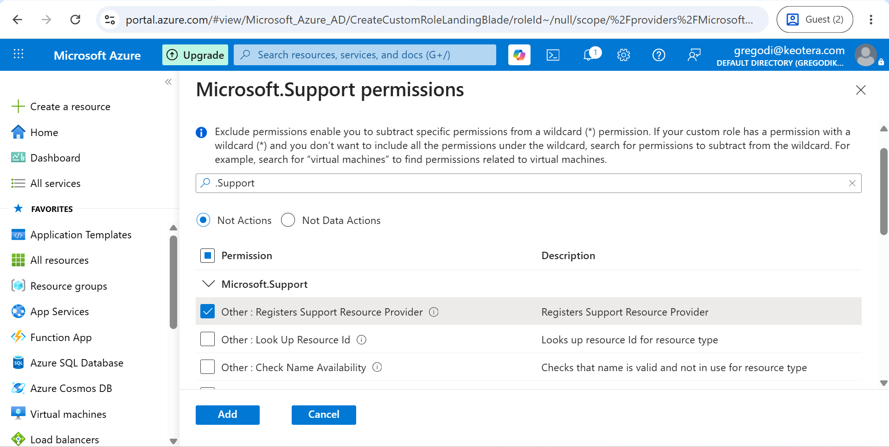

📸 **Screenshot:** `10-permissions-updated.png` — capture the Permissions tab showing the new NotActions entry added.

#### Step 3 — Confirm assignable scope and review JSON
Confirmed `az104-mg1` was listed on the Assignable scopes tab, then reviewed the generated JSON (Actions, NotActions, AssignableScopes) before creating the role.

📸 **Screenshot:** `11-custom-role-json.png` — capture the JSON review screen showing Actions/NotActions/AssignableScopes.

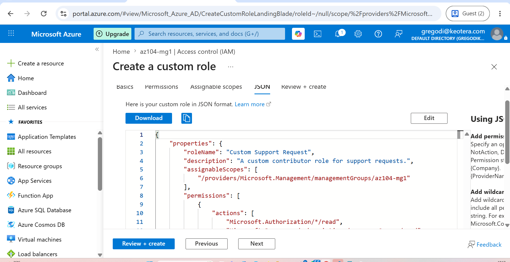

📸 **Screenshot:** `12-custom-role-created.png` — capture confirmation that the custom role was created successfully.

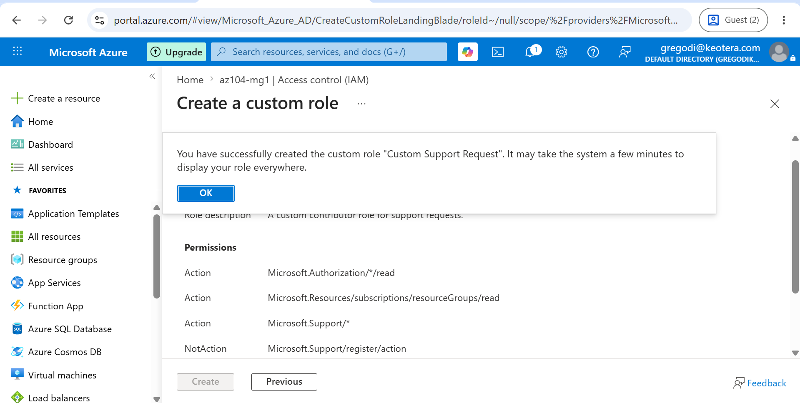

---

### Task 4: Monitor Role Assignments with the Activity Log

#### Step 1 — Review the Activity Log
Opened the `az104-mg1` management group → Activity log, and filtered for role assignment operations.

📸 **Screenshot:** `13-activity-log.png` — capture the Activity log page with the filter configured for role assignment operations.

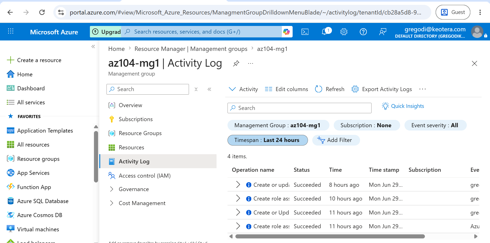

---

## 🧹 Cleanup

After completing the lab, deleted the `az104-mg1` management group to free up resources (Azure Portal → Management group → Delete → confirm).

---

## ⚠️ Challenges Encountered

*(to be filled in — keep notes in `challenges.md` as you go)*

## 💡 Key Takeaways

- **Management groups** logically organize subscriptions and let RBAC/Policy be assigned and inherited across them.
- The **root management group** sits above all management groups and subscriptions, enabling directory-wide policy and role assignments.
- Azure provides many **built-in roles** (Owner, Contributor, Reader, and more specific ones like VM Contributor) — assign the least-privilege role that fits the need.
- **Custom RBAC roles** let you clone a built-in role and add/remove specific permissions (Actions/NotActions) to match the principle of least privilege.
- Best practice: **assign roles to groups, not individuals**, to simplify access management at scale.
- The **Activity Log** provides an audit trail of role assignments and other subscription-level events.

## 🔗 Related Resources

- [Azure RBAC documentation](https://learn.microsoft.com/azure/role-based-access-control/overview)
- [AZ-104 Certification path](https://learn.microsoft.com/credentials/certifications/azure-administrator/)

---

[⬅ Back to AZ-104 series overview](../README.md)
